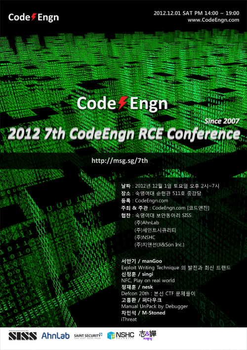

날짜 : 2012. 12. 1. SAT / PM 14:00 ~ 19:00

장소 : 숙명여자대학교 창학관 B107호 젬마홀

주최 & 주관 : CodeEngn.com [코드엔진] &nbsp;

협찬 : 
<a href='http://siss.sookmyung.ac.kr' target='_blank'>숙명여대 보안동아리 SISS</a> | 
<a href='https://www.ahnlab.com' target='_blank'>(주)Ahnlab</a> | 
<a href='http://stsc.co.kr' target='_blank'>(주)세인트시큐리티</a> | 
<a href='https://www.nshc.net' target='_blank'>(주)NSHC</a> | 
<a href='https://jinson.tistory.com' target='_blank'>(주)지앤선(Ji&Son Inc.) </a>

 

### Download All Slides

> Github: <a href='https://github.com/codeengn/codeengn-conference' target='_blank'>2007 - recent data</a>

 

### Exploit Writing Technique의 발전과 최신 트랜드

> <small>서만기</small>

Stack-Based Buffer Overflow에 대한 Exploit Writing Technique에 대한 내용을 주로 다루려고 하고, Stack-Based Buffer Overflow에 대한 기본적인 개념이해를 통해 초기 Exploit Writing Technique을 시작으로 하여, OS의 발전에 따른 추가된 Memory Protection기술을 우회하기 위한 Exploit Writing Technique에 대해 설명한다. 특히 Random Stack, Stack Cookie, safeSEH, ASLR, SEHOP, DEP등의 보호기법을 우회하기 위한 기술을에 대해서 다룰 예정이다. 그리고, Exploit Writing Technique의 발전 과정을 통해 최근 기술들은 주로 어떤 부분에 초점을 맞추는지, Windows 8에서의 Exploit Writing은 어떤 형식으로 이루어 지고 있는지에 대해서 설명한다.

 

### NFC, Play on real world

> <small>신정훈</small>

최근 스마트폰의 보급율이 높아지면서 NFC에 대한 관심이 많아졌다. NFC는 10cm 거리에서 기기간의 통신을 가능하게 해주는 근거리 통신 프로토콜이다. NFC에 대한 기본 개념과 통신원리, 국제/국내 표준을 알아보고, 국내 스마트폰에서 NFC가 들어간 장치의 스펙을 알아 본다. 그리고, 어떤 환경에서 NFC서비스가 사용될 수 있는지와 현재 사용되고 있는 서비스들도 간단하게 볼 예정이며 NFC를 이용하여 교통카드를 위조했던 해킹사례를 간단하게 알아본다. 마지막으로, 실제 NFC기기를 프로그래밍하여 이용, 조작을 해보도록 한다.

 

### Defcon 20th : 본선 CTF 문제풀이

> <small>정재훈</small>

데프콘은 매년 라스베이거스에서 열리는 세계적으로 가장 권위 있는 보안 컨퍼런스 중 하나로 CTF 대회를 진행하고 있다. 올해 데프콘은 특히 20주년을 맞아서 20개팀이 본선에 참가하였으며, 다양한 문제들이 출제되었다. 보통 해킹대회에서의 예선전 풀이는 많지만 본선문제에 관한 정보는 많이 부족하기 때문에 CTF에 출제된 문제중 몇문제를 선정하여 풀이한다.

 

### Manual UnPack by Debugger

> <small>고흥환</small>

실행압축 툴의 본래 취지는 크게 크래커로부터 개발자들의 소프트웨어를 보호하고 온라인 상으로 전송되는 바이너리의 크기를 줄여주는 순기능 역할과 악성코드나 불법적인 바이너리의 내용이나 분석을 어렵게 만드는 역기능 역할의 양면성이 존재한다. 학문적인 접근으로, 실행압축에 대한 리버스엔지니어링 도전은 더 나은 소프트웨어에 대한 발전과 더불어 안전한 소프트웨어 산업 발전을 증진시키는 촉매제 역할을 할 수 있다고 본다. Themida와 UPX 알고리즘을 디버거로 따라가면서 살펴보는 것은 리버시엔지니어에게 안티디버깅을 비롯하여 가상화, 다형성 등의 원리를 이해하고 공부하는데 많은 도움을 줄 것으로 기대한다.

 

### iThreat

> <small>차민석</small>

그동안 Mac 사용자들은 악성코드로부터 안전하다는 믿음이 있었고 Apple사 역시 마케팅에 활용했었다. 이런 믿음은 2012년 4월, 전 세계 65만대의 Mac 컴퓨터가 Flashback에 감염되고 Mac 사용자에 대한 표적공격 악성코드가 발견되면서 Mac 또한 악성코드의 위협으로부터 완전히 자유로울 수 없음이 확인됐다. 지금까지 발견된 주요 Mac 악성코드에 대해 알아보고 Mac 악성코드 분석 방법과 분석시 유의 사항에 대해 발표한다.
